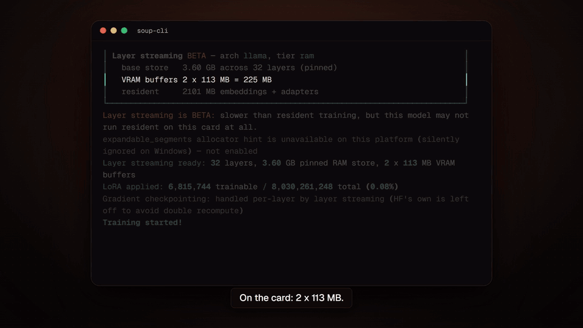
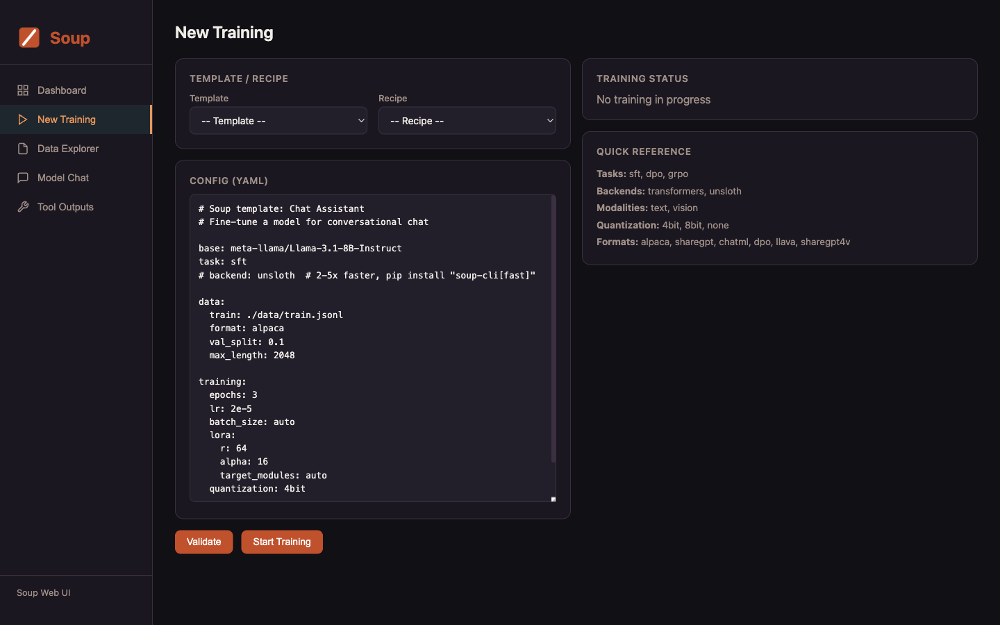

<p align="center">🌍 <strong>English</strong> | <a href="README.tr.md">Türkçe</a></p>

<p align="center">
  
</p>

<h1 align="center">Kadhi</h1>

<p align="center">
  <strong>One YAML file in, a fine-tuned model out. Skip the SSH sessions and the config maze.</strong>
</p>

<p align="center">
  <a href="https://trykadhi.dev">Website</a> &middot;
  <a href="#quick-start">Quick Start</a> &middot;
  <a href="#web-ui">Web UI</a> &middot;
  <a href="#configuration">Config</a> &middot;
  <a href="#documentation">Docs</a> &middot;
  <a href="docs/commands.md">Commands</a> &middot;
  <a href="docs/models.md">Models</a> &middot;
  <a href="https://discord.gg/dgd2pJcjwP">Discord</a> &middot;
  <a href="https://t.me/kadhitasters">Telegram</a> &middot;
  <a href="https://www.producthunt.com/products/kadhi-cli">Product Hunt</a>
</p>

<p align="center">
  <a href="https://pypi.org/project/kadhi-cli/"></a>
  <a href="https://pepy.tech/project/kadhi-cli"></a>
  
  
  <a href="https://trykadhi.dev"></a>
  <a href="https://discord.gg/dgd2pJcjwP"></a>
  <a href="https://t.me/kadhitasters"></a>
  <a href="https://doi.org/10.5281/zenodo.21771064"></a>
</p>

<p align="center">
  <a href="https://www.producthunt.com/products/kadhi-cli?embed=true&amp;utm_source=badge-featured&amp;utm_medium=badge&amp;utm_campaign=badge-kadhi-cli">
    <picture>
      <source media="(prefers-color-scheme: dark)" srcset="https://api.producthunt.com/widgets/embed-image/v1/featured.svg?post_id=1217869&amp;theme=dark">
      
    </picture>
  </a>
</p>

---

Fine-tuning shouldn't require a platform team. Kadhi collapses the whole workflow — data,
recipe, hardware detection, training loop — into a single YAML file and a single command.

```bash
pip install "kadhi-cli[train]"   # add [train] to fine-tune; bare `kadhi-cli` is the light CLI
kadhi init --template chat
kadhi train
```

**Fine-tune an 8B model on a 4 GB laptop GPU.** Layer streaming keeps the frozen base out of
VRAM and feeds it to the GPU one decoder layer at a time. Measured on an RTX 3050 Laptop 4 GB:
Llama-3.1-8B-Instruct + NF4 at **119.6 tok/s, 3.32 GB peak** — bit-exact against a normal
resident run, and reproduced independently on an H100 at 113.00 tok/s in the same 3.32 GB.
(The tok/s figure was measured on v0.72.2, before the v0.73.0 correctness repair that cost
−4.8% at 32B; it has not been re-run on a 4 GB card since.) Opt-in (`stream_layers: true`)
and still BETA —
[how it works](docs/performance-and-quantization.md#layer-streaming-beta-v0720-nf4-v0722-disk--wider-archs-v0723-preference-losses-v0724) ·
[all measurements](benchmarks/) · [paper](https://doi.org/10.5281/zenodo.21771064) ·
**[check it yourself on a free Colab T4](notebooks/proof-4gb.ipynb)** (caps the process to
4 GB, then asserts a streamed model is bit-identical to a normal one)

<p align="center">
  <a href="https://youtu.be/T1LCErE943E"></a><br>
  <sub>Llama-3.1-8B-Instruct + NF4, LoRA, batch 1, seq 512 on an RTX 3050 Laptop 4 GB — <b>3.32 GB peak, 119.6 tok/s</b>. <a href="https://youtu.be/T1LCErE943E">Full video (90s)</a></sub>
</p>

## The problem Kadhi solves

Even seasoned ML teams burn 30-50% of their time on infrastructure plumbing instead of model
quality — chasing CUDA mismatches, babysitting SSH sessions, hand-tuning batch sizes per GPU.
Kadhi absorbs that layer so the only thing left to think about is the recipe.

- 🖥️ **No SSH spelunking.** Point Kadhi at a box; it doesn't hand you a broken shell to debug.
- 📄 **One YAML, one source of truth.** No scattered scripts, no hidden CLI flags to remember.
- ⚙️ **Hardware-aware by default.** Batch size, quantization, and GPU detection are inferred, not guessed.
- 🔒 **Runs on your own iron.** QLoRA on a local GPU — no mandatory cloud dependency.

## What's New

**v0.75.0 — the same `kadhi.yaml` trained a different recipe on MLX than on transformers,
silently.** Six training options were validated, documented, accepted — and read by nothing
on that backend. **All 60 pull requests in this release came from outside the maintainer**,
by 22 people.

- **Breaking: an unknown config key now refuses the load.** v0.74 warned and named this
  release as the deadline. A typo like `quantizaton`, or a key that only exists on a newer
  Kadhi, used to be dropped while the run proceeded with the setting not applied; it now
  fails on the CLI (exit 1) and in the API (`ValueError`), naming the field you probably
  meant. The detector applies the root-level `lora:` remap the schema has honoured
  since v0.40.1, so that spelling is accepted, not refused; the two `kadhi fetch examples`
  files using it moved to the canonical `training.lora`. Every recipe and template loads
  clean, key names are escaped before they reach the terminal, and the scan is bounded.
- **MLX honours the config it accepted.** `train_on_responses_only`, `warmup_ratio` /
  `scheduler` / `weight_decay` / `optimizer`, `max_grad_norm`, `gradient_accumulation_steps`
  and `gradient_checkpointing` were each validated and then dropped on `backend: mlx`. Only
  8 of the 32 optimizer names have an MLX equivalent; the other 24 are refused by name
  instead of silently becoming AdamW. MLX also drives the live dashboard, the tracker and
  `kadhi ui`, and `kadhi doctor --config` lists the settings a backend does not read.
- **Validation loss existed nowhere.** It was computed on every backend and thrown away:
  no metrics column, no event field, nothing on the panel. It is now recorded, streamed
  and displayed.
- **Breaking: `grpo_variant: gspo` is the published sequence-level objective**
  (arXiv:2507.18071), replacing a column-centering heuristic in which a padding token also
  shifted the gradient of every row sharing its column. Existing gspo configs will not
  reproduce prior runs.
- **Web UI read endpoints and SSE require auth**, with short-lived single-use tickets
  instead of a token in a query string; `--public` no longer serves `/docs` and
  `/openapi.json` to the LAN; and a training subprocess no longer hangs when nothing
  reads its output.
- **`torch>=2.6.0`** closes v0.74.0's known limitation: at 2.5.1 `trl>=0.29` could not
  import and every preference trainer was dead. Also fixed: `training.loraplus_lr_ratio`
  crashed every run that set it, and `packing: true` raised on TRL 0.29.

> Python **3.10–3.12** only. On 3.13+, pip used to resolve untested PyTorch wheels that
> crash in the native extension before Kadhi runs at all.

Older highlights live in [CHANGELOG.md](CHANGELOG.md).

## In Development — Adaptation Controller

Kadhi picks a LoRA rank today from dataset size alone, and applies it uniformly to every
layer. The Adaptation Controller replaces that with a measured decision: probe which
layers the task actually pushes against, allocate rank across them under a
trainable-parameter budget, check the plan against a validated peak-VRAM model before
anything trains, and stop growing capacity when the quality gain drops below the
measured noise floor.

```yaml
controller:
  enabled: true
  budget:
    trainable_params: 8M
    vram: 4GB
  probe:
    steps: 50
```

```bash
kadhi plan --config kadhi.yaml --explain   # sensitivity ranking, rank pattern, VRAM breakdown
```

Work is split into four independently shippable phases:

| Phase | Scope | State |
|---|---|---|
| 1 | Exact LoRA capacity accounting; peak-VRAM predictor validated against measurement | Capacity accounting + predictor wiring built and tested; hardware validation run pending |
| 2 | Seed-variance harness; noise floor and baseline numbers | Harness built; run on real hardware pending |
| 3 | Layer sensitivity probe; capacity allocator emitting `lora.rank_pattern`; `kadhi plan` | Open |
| 4 | In-place rank growth; frontier reporting | Stretch |

**Contributing:** [adaptation-controller.md](docs/adaptation-controller.md) is the
architecture; [adaptation-controller-plan.md](docs/adaptation-controller-plan.md) carries
the per-component rationale, acceptance criteria and known risks. Phases 1 and 2 are
self-contained and are the best entry points — each has a stated done-when and a stated
failure condition. Please read the plan's acceptance criteria before opening a PR against
a phase.

## Quick Start

### 1. Install

Kadhi is a command-line application, so the cleanest install gives it its own
environment and puts `kadhi` on your `PATH`:

```bash
# Light core: CLI + config + data tools, no PyTorch
pipx install kadhi-cli
uv tool install kadhi-cli          # same idea, if you already use uv

# Add the training stack (torch, transformers, peft, trl, datasets, …)
pipx install "kadhi-cli[train]"

# Everything (train + serve + ui + data) in one shot
pipx install "kadhi-cli[all]"
```

Already inside a virtualenv, a Colab notebook, or a Docker image? Use `pip`
directly, with the same names and extras:

```bash
pip install kadhi-cli
pip install "kadhi-cli[train]"
pip install "kadhi-cli[all]"
```

Use `pip` rather than `pipx` if you also want to `import kadhi_cli` from your own
code, since pipx deliberately isolates the application from everything else.

The full extras table (`fast`, `mlx`, `serve`, `eval`, `ui`, `vision`, `audio`, …) lives in
[`docs/models.md`](docs/models.md#optional-extras).

> **`error: externally-managed-environment`?** That is
> [PEP 668](https://peps.python.org/pep-0668/), not a Kadhi problem. Debian 12,
> Ubuntu 23.04 and later stop `pip` from writing into the system Python, because
> `apt` manages those files too. `pipx` and `uv tool` sidestep it by giving Kadhi
> its own environment, which is why they are listed first above. `python3 -m venv
> .venv && source .venv/bin/activate` then plain `pip` works just as well.

> **Double quotes, not single.** `"kadhi-cli[train]"` is the only spelling that works in every
> shell — `cmd.exe`, PowerShell, bash and zsh. If you copied `'kadhi-cli[train]'` from an older
> tutorial and pip rejected it, that is the reason:
> [why, and the exact error](docs/models.md#quoting-the-extra).

`kadhi init`, `kadhi data …`, and the other data/inspection commands work on the light install.
Fine-tuning (`kadhi train`) needs the `[train]` extra.

### 2. Create a config

```bash
kadhi init                       # interactive wizard
kadhi init --template chat       # or start from a template
```

Templates: `chat`, `code`, `tool-calling`, `medical`, `reasoning`, `vision`, `kto`, `orpo`,
`simpo`, `ipo`, `bco`, `rlhf`, `pretrain`, `moe`, `longcontext`, `embedding`, `audio`.

### 3. Train, test, ship

```bash
kadhi train --config kadhi.yaml                 # LoRA, quantization, batching — all handled
kadhi chat  --model ./output                    # talk to your model
kadhi push  --model ./output --repo you/my-model

kadhi merge  --adapter ./output                              # merge LoRA into the base
kadhi export --model ./output --format gguf --quant q4_k_m   # GGUF for Ollama / llama.cpp
```

More export targets (ONNX, TensorRT, AWQ, GPTQ, BitNet) and deployment options live in
[`docs/serving-and-export.md`](docs/serving-and-export.md).

## Web UI

Prefer a browser? `kadhi ui` serves a local dashboard for experiments,
training setup, live metrics, dataset exploration and model chat.

```bash
pip install "kadhi-cli[ui]"
kadhi ui
# Opens http://127.0.0.1:7860
```



[Web UI documentation](docs/serving-and-export.md#web-ui)

## Configuration

A complete `kadhi.yaml`:

```yaml
base: meta-llama/Llama-3.1-8B-Instruct
task: sft
# backend: unsloth  # 2-5x faster, pip install "kadhi-cli[fast]"

data:
  train: ./data/train.jsonl
  format: alpaca
  val_split: 0.1

training:
  epochs: 3
  lr: 2e-5
  batch_size: auto
  lora:
    r: 64
    alpha: 16
  quantization: 4bit

output: ./output
```

`config/schema.py` is the single source of truth for every field. Advanced data, training,
and PEFT options are documented under [Documentation](#documentation).

> **Unknown config keys are rejected since v0.75.** A key no model declares — a typo
> like `quantizaton`, or a field that only exists on a newer Kadhi — used to validate
> clean and be discarded, so the run proceeded with the setting simply not applied.
> v0.74 reported it at load with the field you probably meant; from **v0.75** the same
> config fails to load, so fix or remove the key rather than relying on it being
> ignored. See [Unknown config keys](docs/backends-and-ops.md#unknown-config-keys).

## Documentation

The full feature reference lives in [`docs/`](docs/). Start here:

| Guide | Covers |
|---|---|
| [Training tasks & methods](docs/training.md) | SFT, DPO/GRPO/PPO/KTO/ORPO/SimPO/IPO/BCO, tool-calling, PRM, pre-training, distillation, classification, vision/audio/TTS, unlearning, RAFT/RA-DIT, loop-hardening detectors |
| [PEFT, long context & efficiency](docs/peft-and-efficiency.md) | DoRA, LoRA+, rsLoRA, VeRA, OLoRA, NEFTune, PiSSA, ReLoRA, optimizer & PEFT zoo, LLaMA Pro, GaLore, YaRN/LongLoRA, packing, curriculum, auto-tuning |
| [Performance & quantization](docs/performance-and-quantization.md) | QAT, FP8, Quant Menu (I + II), KV-cache, NVFP4, save formats, Cut Cross-Entropy, gradient checkpointing, kernels, activation offloading, layer streaming, multi-GPU / DeepSpeed / FSDP |
| [Data engineering](docs/data.md) | Formats, the Axolotl/LF-parity pipeline, data tools, synthetic generation & forge, quality scorecards, trace tooling, remote datasets, mixing, recipe DAGs |
| [Evaluation & probes](docs/evaluation.md) | Eval design/gate, eval-gated training, benchmarks, NLG metrics, calibration, Elo arena, diagnose, post-train X-ray probes, A/B, drift, tunability, `kadhi advise` |
| [Serving & export](docs/serving-and-export.md) | OpenAI-compatible server, batch inference, benchmarking, merge/export, Anthropic Messages endpoint, speculative decoding (train + measure your own draft), deploy autopilot, Web UI, Agent Forge |
| [Adapters, registry & governance](docs/adapters-and-governance.md) | Adapter lifecycle/management, model registry, Kadhi Cans, the data flywheel (`kadhi loop`), knowledge editing, steering, supply-chain controls (scan/sign/BOM/attest/audit/airgap) |
| [Compliance & governance quickstart](docs/compliance.md) | HIPAA/SOC2/EU-AI-Act/SR-11-7 `init` templates, provenance (BOM/attest/repro-receipt), audit log, air-gap, model-card autogen (`kadhi card`), CI gate (`kadhi ci init`) |
| [Backends, platform & ops](docs/backends-and-ops.md) | MLX/Unsloth backends, alternative hubs, HF Hub integration, autopilot, experiment tracking, plan/apply, env lockfiles, hardware-fit, completions, plugins, utility commands |
| [Adaptation Controller](docs/adaptation-controller.md) | Layer sensitivity probing, `rank_pattern` allocation under a trainable-parameter budget, VRAM feasibility gating, noise-calibrated stopping — plus the [build plan](docs/adaptation-controller-plan.md) |
| [Command reference](docs/commands.md) | The full `kadhi` command list |
| [Supported models & extras](docs/models.md) | Recommended model families, the VRAM size guide, the pip extras matrix |

## Data Formats

Alpaca, ShareGPT, ChatML, preference pairs (DPO / ORPO / SimPO / IPO / KTO), vision, audio,
ASR, plaintext, embedding, RAFT and more — all auto-detected from JSONL, JSON, CSV, Parquet or
TXT, so in most cases you point `data.train` at a file and nothing else changes. Schemas with a
worked example per format, plus the data pipeline (remote URIs, streaming, sharding,
interleaving, vocab expansion, document ingestion), are in
[`docs/data.md`](docs/data.md#data-formats).

## Common Commands

```bash
kadhi train  --config kadhi.yaml        # train (SFT/DPO/GRPO/PPO/KTO/ORPO/SimPO/IPO/...)
kadhi infer  --model ./output --input prompts.jsonl   # batch inference
kadhi chat   --model ./output          # interactive chat
kadhi serve  --model ./output          # OpenAI-compatible API server
kadhi ui                               # local browser dashboard
kadhi merge  --adapter ./output        # merge LoRA into the base model
kadhi export --model ./output --format gguf           # export for deployment
kadhi eval   benchmark --model ./output               # evaluate
kadhi data   inspect ./data/train.jsonl               # dataset stats
kadhi recipes list                     # 100+ ready-made model recipes
kadhi autopilot --model <id> --data d.jsonl --goal chat  # zero-config
kadhi doctor                           # check GPU / deps / environment
```

The complete command list is in [`docs/commands.md`](docs/commands.md).

## Supported Models

Kadhi works with **any** text-generation model on the
[HuggingFace Hub](https://huggingface.co/models?pipeline_tag=text-generation) — if it loads with
`AutoModelForCausalLM`, it works, zero config changes. Llama 3.x/4, Qwen 2.5/3, Gemma 3, Mistral,
Mixtral, DeepSeek R1/V3, Phi-4, and 100+ others ship as ready-made recipes (`kadhi recipes list`).

| VRAM | Max model (QLoRA 4-bit) | Example |
|---|---|---|
| 8 GB | ~7B | Llama-3.1-8B, Mistral-7B |
| 16 GB | ~14B | Phi-4-14B, Qwen2.5-14B |
| 24 GB | ~34B | CodeLlama-34B, Yi-1.5-34B |
| 48 GB | ~70B | Llama-3.3-70B |
| 80 GB+ | 70B+ (full) or MoE | Mixtral-8x22B, DeepSeek-V3 |

Full model + vision tables and the optional-extras matrix are in [`docs/models.md`](docs/models.md).

## Docker

Run Kadhi without installing CUDA or PyTorch locally (image published to GHCR on every release):

```bash
docker pull ghcr.io/makazhanalpamys/kadhi:latest
docker run --gpus all -v $(pwd):/workspace ghcr.io/makazhanalpamys/kadhi train --config kadhi.yaml
docker compose up   # or build locally
```

## Requirements

- Python 3.10, 3.11 or 3.12 (those are the versions CI tests; 3.13+ is not supported yet
  because the PyTorch stack has not been validated there)
- GPU with CUDA (recommended), Apple Silicon (MPS), or CPU (experimental — very slow)
- 8 GB+ VRAM for 7B models with QLoRA

All training tasks run on CPU for testing (quantization auto-disabled). Optional extras
(`train`, `all`, `fast`, `vision`, `qat`, `serve`, `serve-fast`, `ui`, `eval`, `deepspeed`,
`liger`, `mlx`, `onnx`, `tensorrt`, …) are listed in
[`docs/models.md`](docs/models.md#optional-extras).

## Troubleshooting

```bash
kadhi doctor    # GPU, system resources, dependencies, and version in one place
```

CUDA wheels, version mismatches: [`docs/backends-and-ops.md`](docs/backends-and-ops.md#troubleshooting).

## Development

```bash
git clone <this-repo>
cd kadhi
pip install -e ".[dev]"

ruff check src/kadhi_cli/ tests/    # lint
pytest tests/ -v                   # unit tests (fast, no GPU)
pytest tests/ -m smoke -v          # smoke tests (downloads a tiny model, trains)

pre-commit install                 # optional: ruff lint+format on commit
```

See [CONTRIBUTING.md](CONTRIBUTING.md) for the full workflow and [SECURITY.md](SECURITY.md) to
report a vulnerability. Telemetry is strictly opt-in (`KADHI_TELEMETRY=1`, default off; see [Privacy Policy](docs/backends-and-ops.md#privacy-policy)).

## Support Kadhi

Kadhi is Apache-2.0 and free — and stays that way. It is built and maintained in the open on a
single 4 GB laptop, which is why every performance number in these docs is measured rather than
claimed.

If Kadhi saved you a training run, starring the repo helps most, and it costs nothing. If you
would like to fund the work directly:

**[❤️ Donate](https://buy.stripe.com/4gMcN441k3pha3T19ye7m04)** — one-off, any amount (use
*Change amount* on the checkout page). Payments are processed by Stripe under the maintainer's
registered business, **MePlay, Inc.** — that name, not "Kadhi", is what appears on the checkout
page and on your card statement.

Donations buy GPU time for the hardware-gated work — multi-GPU, 8B+ validation, Apple Silicon —
that a single 4 GB laptop cannot reach.

The other way to move exactly those items is **hardware itself**. They ship behind honest
"requires \<hardware\>" gates rather than unverified claims, so if you have access to a bigger
box — or GPU credits going unused — running one of the `help wanted` issues in the issue tracker
and posting the numbers helps as much as funding the GPU time would. Those issues say exactly
what is blocked on hardware today.

## Contributors

Built by the community ❤️ — thank you to everyone who has contributed. See
[CONTRIBUTORS.md](CONTRIBUTORS.md).

## Contact

Bugs and feature requests belong in the issue tracker, questions in Discussions — both get
answered faster and help the next person with the same problem.

For live chat, setup help, and everything that reads better as a conversation, join the
[Discord](https://discord.gg/dgd2pJcjwP) or the [Telegram community](https://t.me/kadhitasters).
Anything that should still be findable in six months
belongs in Issues or Discussions — a Discord answer helps one person, an issue helps everyone
who hits the same thing. The [Code of Conduct](CODE_OF_CONDUCT.md) applies there too.

For anything that does not fit in public — security reports (see [SECURITY.md](SECURITY.md)),
Code of Conduct matters, or press — email **team@trykadhi.dev**. That is the project address
and the right one for anything Kadhi-related. **makazanalpamys@gmail.com** is the maintainer's
personal address; it reaches the same person and is a fine fallback.

## Citing Kadhi

Layer streaming — training an 8B model on a 4 GB laptop GPU by streaming the frozen base from
host RAM one decoder layer at a time — is described in a preprint, together with the correctness
protocol that verifies a streamed run against a resident one (forward and backward stated
separately, because they are two claims and not one).

> Makazhan, A. (2026). *Exact Layer Streaming: LoRA Fine-Tuning of an 8B Model on a 4 GB Laptop
> GPU* (v3). Zenodo. https://doi.org/10.5281/zenodo.21918325

**Version 3 (13 August 2026) is current.** The title and the claim are unchanged — 8B on 4 GB —
and no measured number has changed since v1. What v3 does is **withdraw an explanation we had
published**, which is also the shortest way to describe what the paper is for:

- **Retracted in v3: "layer streaming is bound by host-to-device transfer, not by the GPU."**
  That was an *inference* from the H100 replication below, and it had never been measured. We
  measured it on 11 August and it is false at the published configuration: deleting every
  host-to-device byte buys **1.4%**, the compute stream waits on a copy for **0.20%** of the
  step, and the step runs at **71.3%** of that card's same-session GEMM ceiling. The largest
  streaming-specific cost is the per-layer NF4 dequantisation, at 9.8%
  ([the record](benchmarks/probe-v0.73.0-what-bounds-streaming.md)). Every measurement stands;
  the replication survives in a weaker form — the constraint is common to both machines and is
  not the GPU's compute.
- **Replication on hardware nothing like the original** (added in v2): 119.6 tok/s on the RTX
  3050 against a median 113.00 on an H100, at the same 3.32 GB peak.
- **A silent wrong-gradient defect, found and repaired.** On NF4 above ~165 MiB per layer the
  forward stayed bit-exact and the loss curve looked healthy while the gradients were wrong. The
  cause is named in the upstream library and reported there; the repair is gated against controls
  on real 32B and 72B.
- **Bit-exactness at real model sizes** instead of three-layer toys: forward from 0.5B to 72B,
  backward at 8B and 14B.
- **Trained-model quality, measured for the first time**, and indistinguishable from a resident run.
- **A comparison against DeepSpeed** — including the result that does not flatter us: eight cards
  of ZeRO-3 are slower than one card training resident.
- **The limitations section rewritten**: of v1's ten items, one closed and four more narrowed,
  and seven new ones added.

Cite the version you used. `10.5281/zenodo.21771064` is the concept DOI and always resolves to
the latest version (v3 today); v1 and v2 remain citable at their own version DOIs and are not
edited — the retraction above is a new version precisely so that the record of what we claimed,
and when, stays intact.

The measurement records behind every number in it are in [`benchmarks/`](benchmarks/), published
as written — including the failures, the assumptions that turned out wrong, and the numbers that
were measured and then discarded.

```bibtex
@misc{makazhan2026exact,
  title        = {Exact Layer Streaming: LoRA Fine-Tuning of an 8B Model on a 4 GB Laptop GPU},
  author       = {Makazhan, Alpamys},
  year         = {2026},
  publisher    = {Zenodo},
  version      = {v3},
  doi          = {10.5281/zenodo.21918325},
  url          = {https://doi.org/10.5281/zenodo.21918325}
}
```

## License

[Apache-2.0](LICENSE). Copyright © the Kadhi contributors.
